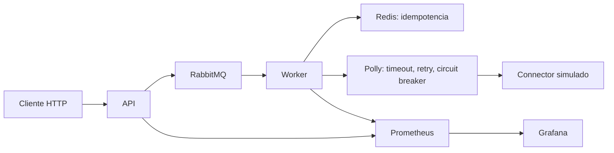

# IntegrationHub

[](https://github.com/FrancoJCabral/IntegrationHub/actions/workflows/ci.yml)

Portfolio backend en .NET 8 que demuestra cómo recibir solicitudes de integración, desacoplar su ejecución mediante mensajería y manejar fallos transitorios y entregas duplicadas. Los conectores CRM, ERP y Payments son simulados: el foco es el flujo y sus garantías, no integrar proveedores comerciales.

## Arquitectura



- **API → RabbitMQ → Worker → Connector:** POST devuelve 202/Location/Pending; publicación con confirmación, consumo con ACK manual.
- **Polly:** timeout por intento, retries exponenciales con jitter y circuit breaker por conector.
- **Redis:** reserva atómica por JobId con token propietario y TTL; completed sólo tras éxito. Un duplicado se confirma sin ejecutar otra vez el conector. Un fallo libera la reserva y conserva NACK sin requeue.
- **OpenTelemetry:** trazas HTTP/publicación/consumo/conector correlacionadas por W3C; eventos de retry y duplicado. Exportación de trazas a consola.
- **Prometheus/Grafana:** seis contadores y un dashboard provisionado: publicados, procesados, duplicados, ejecuciones, fallos y retries.

Stack: .NET SDK 8.0.424, ASP.NET Core, RabbitMQ.Client 7.2.2, Polly.Core 8.7.0, StackExchange.Redis 3.2.0, OpenTelemetry 1.18.0 (exporter Prometheus 1.18.0-beta.1), xUnit/Moq. Compose usa RabbitMQ 4.3.5, Redis 8.2.9, Prometheus 3.13.1 y Grafana 12.4.10.

## Ejecutar localmente

Requisitos: .NET SDK 8.0.424 y Docker con Linux containers. Desde la raíz:

```powershell
# Sólo si no existe .env:
Copy-Item .env.example .env
dotnet restore
docker compose up -d
```

.env está ignorado; sus valores de ejemplo son exclusivamente para la demo local. .NET no lo carga automáticamente. En cada terminal de API/Worker, cargar las credenciales sin imprimirlas:

```powershell
foreach ($line in Get-Content .env) {
    if ($line -match '^RABBITMQ_USER=(.*)$') { $env:RabbitMq__UserName = $Matches[1] }
    if ($line -match '^RABBITMQ_PASSWORD=(.*)$') { $env:RabbitMq__Password = $Matches[1] }
}
```

Terminal API:

```powershell
$env:Messaging__Provider = 'RabbitMq'
dotnet run --project backend/IntegrationHub.Api --no-launch-profile --urls http://0.0.0.0:5180
```

Terminal Worker:

```powershell
$env:Worker__Enabled = 'true'
$env:Idempotency__Provider = 'Redis'
dotnet run --project workers/IntegrationHub.Worker --no-launch-profile --urls http://0.0.0.0:9464
```

El binding 0.0.0.0 permite scraping desde Docker Desktop: usar sólo en una red de desarrollo de confianza. API y Worker corren fuera de Docker. Sin estas variables, los providers son InMemory y el Worker está deshabilitado.

```powershell
Invoke-RestMethod http://localhost:5180/api/integrations/jobs -Method Post -ContentType application/json -Body '{"connector":"Crm","operation":"Sync","externalId":"demo-1"}'
```

Endpoints: GET /api/health, POST /api/integrations/jobs, GET /api/integrations/jobs/{id}; métricas en API :5180/metrics y Worker :9464/metrics. Swagger sólo en Development.

- RabbitMQ Management: http://localhost:15672 (credenciales de .env).
- Prometheus: http://localhost:9090/targets.
- Grafana: http://localhost:3000/d/integrationhub/integrationhub (lectura anónima local).

Detener API/Worker con Ctrl+C y ejecutar docker compose down. Los datos de infraestructura son efímeros.

## Kubernetes y Azure-ready

[deploy/k8s](deploy/k8s) contiene seis Deployments de una réplica, Services internos y ConfigMaps para configuración y dashboard. Es una demostración de despliegue; **no se desplegó ni validó en AKS**. Las imágenes example.azurecr.io/integrationhub-api:portfolio e integrationhub-worker:portfolio son placeholders que deben reemplazarse por imágenes publicadas.

Los proyectos Web pueden empaquetarse con el soporte de contenedores del SDK, sin Dockerfile. Por ejemplo, después de autenticarse en un ACR propio:

```powershell
# Reemplazar miacr por el registro propio; repetir para Worker con su proyecto/repository.
dotnet publish backend/IntegrationHub.Api -c Release --os linux --arch x64 /t:PublishContainer -p:ContainerRegistry=miacr.azurecr.io -p:ContainerRepository=integrationhub-api -p:ContainerImageTag=portfolio
```

Antes de aplicar, crear un namespace integrationhub y un Secret rabbitmq-credentials con claves username/password mediante el mecanismo local elegido; no versionar sus valores. Configurar permiso de pull desde ACR. Con las imágenes sustituidas:

```powershell
kubectl create namespace integrationhub
# Crear el Secret rabbitmq-credentials antes de iniciar los workloads.
kubectl apply -n integrationhub -f deploy/k8s
kubectl port-forward -n integrationhub svc/grafana 3000:3000
```

Todos los recursos deben estar en el mismo namespace. RabbitMQ/Redis no tienen persistencia ni alta disponibilidad. Las readiness probes verifican disponibilidad básica, no garantizan dependencias; el Worker puede reiniciarse hasta que RabbitMQ esté listo. El scraping por Service está pensado para una sola réplica. No incluye Ingress, TLS, Helm ni operadores.

En Azure, **AKS** podría ejecutar estos workloads y **ACR** almacenar sus imágenes. Redis podría sustituirse por **Azure Cache for Redis o un equivalente administrado**, ajustando conexión/TLS y secretos; RabbitMQ podría ser externo/administrado o containerizado según el escenario. **Azure Monitor con OpenTelemetry** sería una evolución posible para exportar telemetría. No se crearon recursos Azure, Terraform, Bicep ni despliegues automáticos.

## Tests y CI

```powershell
dotnet build
dotnet test
docker compose config --quiet
```

124 tests: 27 Domain, 41 API y 56 Worker. Cubren dominio, contratos HTTP, publicación/consumo, resiliencia, idempotencia y correlación/métricas. La suite no requiere infraestructura externa. [GitHub Actions](.github/workflows/ci.yml) ejecuta checkout, setup de .NET, restore, build y test para push y pull requests a main; no realiza deployment.

Las pruebas reales previas confirmaron RabbitMQ/Redis, duplicados sin segunda ejecución, targets Prometheus up y dashboard Grafana con datos. Detalles en [Etapa 4](docs/stage-4-docker-redis.md) y [Etapa 5](docs/stage-5-observability.md).

## Límites intencionales

Proyecto de portfolio finalizado, sin DB, outbox, autenticación, frontend ni garantías de producción. El repositorio de jobs es InMemory en API: GET conserva Pending y no refleja el resultado del Worker. No hay consistencia transaccional entre guardar y publicar ni procesamiento exactly-once. Expiración del lease, reinicios o fallo después del efecto externo pueden permitir repetición; un duplicado confirmado durante un intento fallido no se recupera automáticamente.

Conectores simulados, estado efímero, una réplica y acceso local simplifican la demostración. Las trazas no tienen almacenamiento central; los contadores reinician con el proceso. Los manifests y la propuesta Azure muestran preparación arquitectónica, no una certificación de operación en producción.
